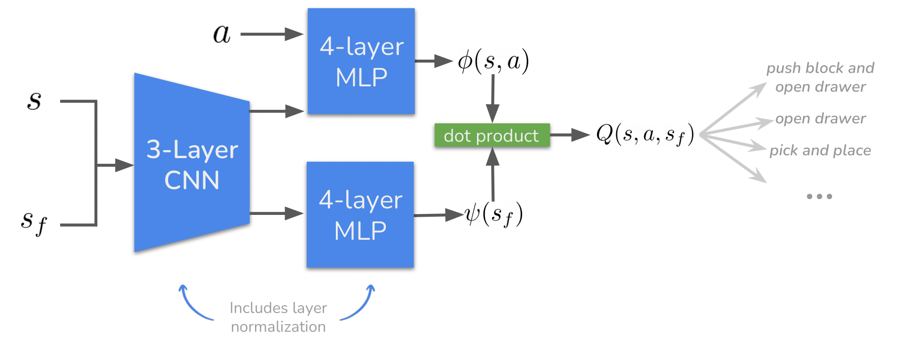

# [Stabilizing Contrastive RL: Techniques for Offline Goal Reaching](https://arxiv.org/abs/2306.03346)
<p align="center"></p>

<p align="center"> Chongyi Zheng, &nbsp; Benjamin Eysenbach, &nbsp; Homer Walke, &nbsp; Patrick Yin, &nbsp; Kuan Fang, <br> Ruslan Salakhutdinov &nbsp; Sergey Levine</p>
<p align="center">
    <a href="https://arxiv.org/abs/2306.03346">paper</a>, <a href="https://chongyi-zheng.github.io/stable_contrastive_rl">website</a>
</p>

*Abstract*: In the same way that the computer vision (CV) and natural language processing (NLP) communities have developed self-supervised methods, reinforcement learning (RL) can be cast as a self-supervised problem: learning to reach any goal, without requiring human-specified rewards or labels. However, actually building a self-supervised foundation for RL faces some important challenges. Building on prior contrastive approaches to this RL problem, we conduct careful ablation experiments and discover that a shallow and wide architecture, combined with careful weight initialization and data augmentation, can significantly boost the performance of these contrastive RL approaches on challenging simulated benchmarks. Additionally, we demonstrate that, with these design decisions, contrastive approaches can solve real-world robotic manipulation tasks, with tasks being specified by a single goal image provided after training.

This repository contains code for running stable contrastive RL algorithm.

```
@misc{zheng2023stabilizing,
      title={Stabilizing Contrastive RL: Techniques for Offline Goal Reaching}, 
      author={Chongyi Zheng and Benjamin Eysenbach and Homer Walke and Patrick Yin and Kuan Fang and Ruslan Salakhutdinov and Sergey Levine},
      year={2023},
      eprint={2306.03346},
      archivePrefix={arXiv},
      primaryClass={cs.LG}
}
```

## Installation

### Create Conda Env

Install and use the included anaconda environment.
```
$ conda env create -f conda_env/stable_contrastive_rl.yml
$ source activate stable_contrastive_rl
(stable_contrastive_rl) $
```

### Dependencies

Download the dependency repos.
- [bullet-manipulation](https://github.com/chongyi-zheng/bullet-manipulation) (contains environments): ```https://github.com/chongyi-zheng/bullet-manipulation```
- [multiworld](https://github.com/vitchyr/multiworld) (contains environments): ```git clone https://github.com/vitchyr/multiworld```

Add dependency paths.
```
export PYTHONPATH=$PYTHONPATH:/path/to/multiworld
export PYTHONPATH=$PYTHONPATH:/path/to/bullet-manipulation
export PYTHONPATH=$PYTHONPATH:/path/to/bullet-manipulation/bullet-manipulation/roboverse/envs/assets/bullet-objects
export PATH=$PATH:/path/to/anaconda/envs/stable_contrastive_rl/bin
```

### Setup Config File

You must setup the config file for launching experiments, providing paths to your code and data directories. Inside `rlkit/launchers/config_template.py`, fill in the appropriate paths. You can use `rlkit/config/launcher_config_template.py` as an example reference.

```cp rlkit/launchers/config_template.py rlkit/launchers/config.py```

## Running Experiments

### Offline Dataset and Goals
Download the simulation data and goals from [here](https://drive.google.com/file/d/1znc5-gX_ICEg3EjvWSSjEUzhobB_qILb/view?usp=sharing). Alternatively, you can recollect a new dataset by following the instructions in [bullet-manipulation](https://github.com/chongyi-zheng/bullet-manipulation).

### Training Stable Contrastive RL
```
python experiments/train_eval_stable_contrastive_rl.py 
--data_dir DATA_PATH --base_log_dir LOG_DIR
--local --gpu 
--name exp
--arg_binding eval_seeds=EVAL_SEED
```

The `EVAL_SEED` corresponds to the name of evaluation tasks:
```
drawer: evalseeds=49
pick and place (table): evalseeds=12
pick and place (drawer): evalseeds=37
push block, open drawer: evalseeds=31
```

## Questions?
If you have any questions, comments, or suggestions, please reach out to Chongyi Zheng (chongyiz@andrew.cmu.edu).